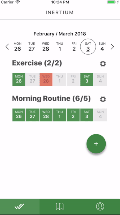
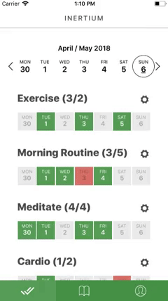
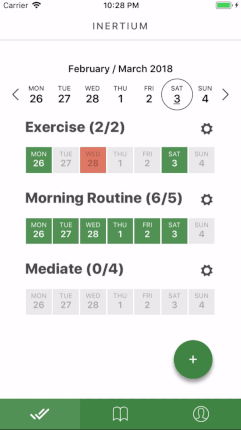
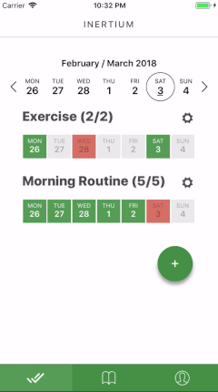

# Inertium Habit Tracker

#### Inertium is a minimalistic habit tracker application for iOS and Android

---

## 👋 Intro

"We are what we repeatedly do. Excellence, then, is not an act, but a habit." — Aristotle

Inertium mobile application lets you track all of your daily habits in one place.

User-facing features:

- Habit customisation (create/rename/remove)
- Item-tracking (pass/fail/skip)
- Weekly-view
- Note-taking
- Seamless Cloud Sync for registered users

## ☑️ Specifics

Inertium is written in [TypeScript](https://www.typescriptlang.org/) and built on-top of [React Native](http://facebook.github.io/react-native/).

- **Platform**: iOS & Android
- **State Management**: [Redux Toolkit](https://redux-toolkit.js.org/)
- **Routing and Navigation**: [React Navigation](https://reactnavigation.org/)
- **Async Actions**: [Redux Thunk](https://github.com/gaearon/redux-thunk)
- **Data Caching**: [Redux Persist](https://github.com/rt2zz/redux-persist)
- **Cloud Sync and Authentication**: [Firebase](https://firebase.google.com/)
- **UI Toolkit**: [Native Base](https://nativebase.io/)
- **Preview and Simulation**: [Expo](https://expo.io/)
- **Testing**: [Jest](https://jestjs.io/) and [React Native Testing Library](https://github.com/callstack/react-native-testing-library)

---

## 📖 Demonstration

### Create and Reorder Habits




### Track Items Across Weeks




---

## 🚀 Setup

#### 1. Clone and Install

```bash
# Clone the repo
git clone git@github.com:narvidas/inertium.git

# Install dependencies
yarn install

```

Also ensure there is a `firebaseConfig.js` file under `src/config/remote/` folder so the app can access your Firebase auth and real-time database instances.

#### 2. Run the App

```bash
# Run the app in iOS Simulator
yarn ios

# Alternatively for the Android Simulator
yarn android
```

#### 3. Tests

```bash
# Run tests once
yarn test

# Run tests continuously (in watch mode)
yarn test:watch
```

