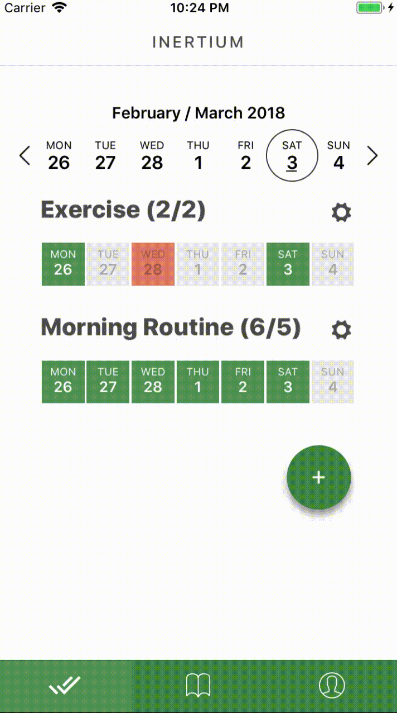
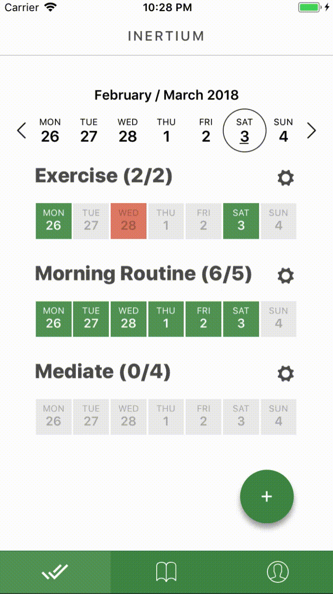
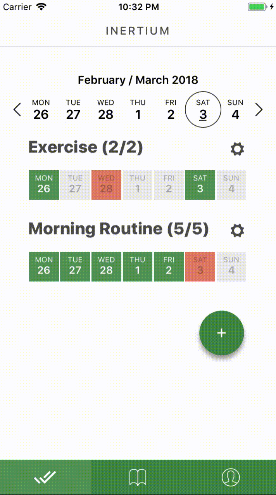

[](https://github.com/feross/standard)


# Inertium Habit Tracker

#### Inertium app helps you track your progress and achieve your objectives 


---

## 👋 Intro


"We are what we repeatedly do. Excellence, then, is not an act, but a habit."  — Aristotle

Inertium application that lets you track your daily habits one place. 

User-facing features:

-  Habit Customisation
-  Item Tracking
-  Weekly-view 
-  Seamless Cloud Sync for Registered Users

## ☑️ Specifics

Inertium is built on-top of [React Native](http://facebook.github.io/react-native/).

- __Platform__: iOS & Android
- __State Management__: [Redux](https://redux.js.org/docs/introduction/)
- __Routing and Navigation__: [React Native Router Flux](https://github.com/aksonov/react-native-router-flux)
- __Data Caching__: [Redux Persist](https://github.com/rt2zz/redux-persist) 
- __Cloud Sync and Authentication__: [Firebase](https://firebase.google.com/)
- __UI Toolkit/s__: [Native Base](https://nativebase.io/) 
- __Code Style__: [Airbnb's JS Linting](https://github.com/airbnb/javascript)
- __Preview and Simulation__: [Expo](https://expo.io/)

---

## 📖 Demonstration
### Create and Remove Habits



### Track items across weeks



---

## 🚀 Setup

#### 1. Clone and Install

```bash
# Clone the repo
git clone https://github.com/narvidas/inertium.git

# Install dependencies
npm i
```

#### 2.1. Run the the App

```bash
# Start the React Native packager
npm start
```

Instructions are shown in the terminal. You can select to open it in:

- An emulator (either iOS or Android)
- Your mobile device with the [Expo app](https://expo.io/)


---

## 👊 Credits

- [React Native Starter Kit](https://github.com/mcnamee/react-native-starter-kit)
- [Building Applications with React and Redux in ES6](https://www.pluralsight.com/courses/react-redux-react-router-es6)

---

Please [get in touch](https://www.google.co.uk) if you want to contribute.

---
