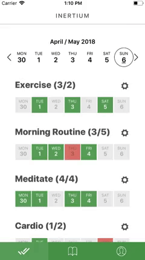

[](https://github.com/airbnb/javascript)

# Inertium Habit Tracker

#### Inertium is a minimalistic habit tracker application for iOS and Android.

---

## 👋 Intro

"We are what we repeatedly do. Excellence, then, is not an act, but a habit." — Aristotle

Inertium mobile application lets you track all of your daily habits in one place.

User-facing features:

- Habit customisation (create/rename/remove)
- Item-tracking (pass/fail/skip)
- Weekly-view
- Note-taking
- Seamless Cloud Sync for registered users

## ☑️ Specifics

Inertium is written in ES6 and built on-top of [React Native](http://facebook.github.io/react-native/).

- **Platform**: iOS & Android
- **State Management**: [Redux](https://redux.js.org/docs/introduction/)
- **Routing and Navigation**: [React Native Router Flux](https://github.com/aksonov/react-native-router-flux)
- **Async Actions**: [Redux Thunk](https://github.com/gaearon/redux-thunk)
- **Data Caching**: [Redux Persist](https://github.com/rt2zz/redux-persist)
- **Cloud Sync and Authentication**: [Firebase](https://firebase.google.com/)
- **UI Toolkit**: [Native Base](https://nativebase.io/)
- **Code Style**: [Airbnb's JS Linting](https://github.com/airbnb/javascript)
- **Preview and Simulation**: [Expo](https://expo.io/)

---

## 📖 Demonstration

### Create and Reorder Habits




### Track Items Across Weeks


---

## 🚀 Setup

#### 1. Clone and Install

```bash
# Clone the repo
git clone https://github.com/narvidas/inertium.git

# Install dependencies
npm i
```

#### 2. Run the the App

```bash
# Start the React Native packager
npm start
```

Instructions are shown in the terminal. You can select to open it in:

- An emulator (either iOS or Android)
- Your mobile device with the [Expo app](https://expo.io/)

---

## 👊 Credits

- [React Native Starter Kit](https://github.com/mcnamee/react-native-starter-kit)
- [Building Applications with React and Redux in ES6](https://www.pluralsight.com/courses/react-redux-react-router-es6)

---

Get in touch if you'd like to contribute.

---
